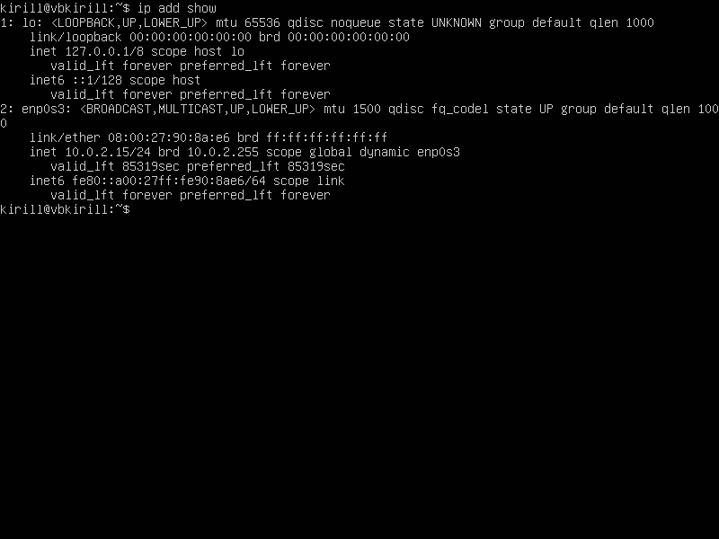
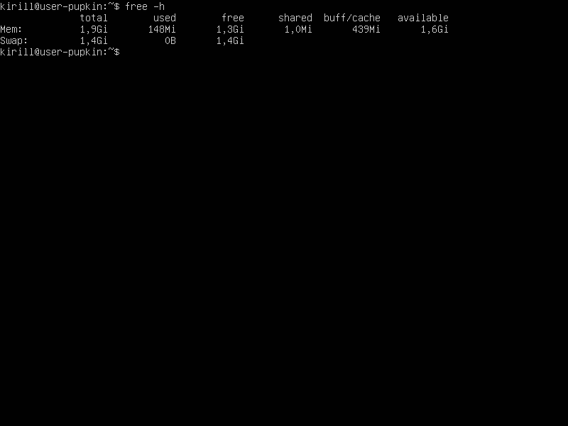
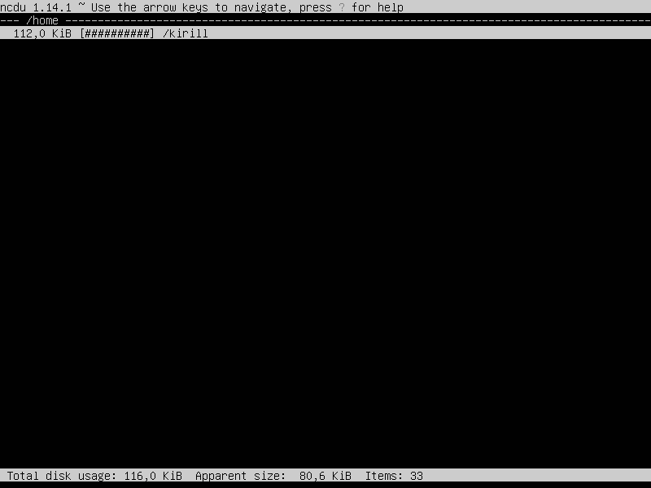

## Part 1. Установка ОС

1. Установка Ubuntu Ubuntu 20.04 Server LTS без графического интерфейса. Для этого мы используем программу Virtual Box.

2. Узнать версию. Для этого мы используем команду `cat /etc/issue.`

## Part 2. Создание пользователя

1. Для создания нового пользователя мы используем следующие команды:
`useradd -D` (для того, чтобы посмотреть, какие параметры будут использоваться по умолчанию) и затем `sudo useradd pupkin.`

После того, как мы добавили нового пользователя, мы вносим его в adm и проверяем, получилось ли с помощью команд `sudo usermod -a -G adm a1234` и проверяем с помощью команды `cat /etc/passwd.` 

## Part 3. Настройка сети ОС

1. Перед тем, как задать машине имя user-1 мы посмотрим, как она называется. Для этого используем команду `hostnamectl.`

Чтобы изменить имя машины на user-1 используем команду `sudo hostnamectl set-hostname user-1.`

И снова проверяем имя нашей машины.

2. Установка временной зоны, соответствующей текущему местоположению.

Для начала мы посмотрим все существующие зоны. Для этого вводим в терминал команду `ls /usr/share/zoneinfo/.`

После того, как мы увидели все зоны, выбираем нужную, используя команду `sudo timedatectl set-timezone Europe/Moscow.`

Затем проверяем наш часовой пояс при помощи `date.`

3. Теперь выводим названия сетевых интерфейсов с помощью консольной команды. 

Так как они изначально не установлены, то мы с помощью команды `sudo apt install net-tools` устанавливаем необходимые настройки.

Затем вводим в термиинал команду `ifconfig.`

lo (loopback device) – виртуальный интерфейс, присутствующий по умолчанию в любом Linux. Он используется для отладки сетевых программ и запуска серверных приложений на локальной машине. С этим интерфейсом всегда связан адрес 127.0.0.1. У него есть dns-имя – localhost. Посмотреть привязку можно в файле /etc/hosts.

4. Определяем и выводим на экран внешний ip-адрес шлюза (ip) и внутренний IP-адрес шлюза, он же ip-адрес по умолчанию (gw) с помощью команды `ip add show.`

DHCP (Dynamic Host Configuration Protocol) — сетевой протокол, позволяющий сетевым устройствам автоматически получать IP-адрес и другие параметры, необходимые для работы в сети TCP/IP.

5. Для того, чтобы определить и вывести на экран внешний ip-адрес шлюза (ip) и внутренний IP-адрес шлюза, он же ip-адрес по умолчанию (gw) мы используем команду `ip route.`

Внутренний ip адрес шлюза: 10.0.2.2

Внешний ip адрес шлюза: 10.0.2.15

5. Задаём статичные настройки ip, gw, dns. Используем публичный DNS серверы.
Для этого мы вводим команду `sudo nano vim /etc/netplan/00-installer-config.yaml`, чтобы задать статичные настройки вручную.

Меняем dhcp4 на false, в addresses и gateway4 прописываем статические адреса. В addresses раздела nameservers указываем публичные серверы 1.1.1.1 & 8.8.8.8.

Чтобы перезагрузить машину, используем команду `sudo netplan apply.`

После перезагрузки мы проверяем, применились ли установленные вручную настройки с помощью команды `ifconfig.`

А теперь пропингуем наши удалённые хосты с помощью команд `ping 1.1.1.1 -c 3` & `ping ya.ru -c 3.`

Видим, что наши хосты успешно пропингованы, есть фраза «0% packet loss».

## Part 4. Обновление ОС
 
 Для того, чтобы обновить системные пакеты нужно ввести команду 'sudo apt upgrade'.

 

 Повторно вводим команду, чтобы убедиться, что пакеты обновились.

 
 
 ## Part 5. Использование команды sudo

 Перед этим нужно создать группу с именем admin.
 Делаем это с помощью команды 'sudo groupadd admin'.

Для того, чтобы разрешить юзеру выполнять команду sudo, пропишем следующую команду: `sudo usermod -aG sudo pupkin.` Теперь команда должна работать должным образом.

Предварительно обновим пароль для pupkin, чтобы совершать дальнейший шаги 'sudo passwd pupkin'

Далее вводим команду 'hostnamectl' для проверки текущего имени, а затем с помощью команды 'sudo -u pupkin hostnamectl set-hostname userpupkin' меняем имя и проверяем изменилось ли оно
командой 'hostnamectl'

Имя изменилось, а значит задание выполнено.

Sudo – это утилита для операционных систем семейства Linux, позволяющая пользователю запускать программы с привилегиями другой учётной записи, как правило, суперпользователя.

## Part 6. Установка и настройка службы времени

Выводим время нашего часового пояса с помощью команды 'date'

В большинстве современных версий Ubuntu используется systemd-timesyncd для синхронизации времени. Чтобы проверить его статус, выполняем команду 'sudo systemctl status systemd-timesyncd'

Чтобы включить ее автоматический запуск при загрузке системы, выполняем 'sudo systemctl enable systemd-timesyncd'

После того как служба будет запущена, можем проверить настройки синхронизации времени с помощью команды 'timedatectl show'

Вывод следующей команды содержит NTPSynchronized=yes, а значит задание выполнено

## Part 7. Установка и использование текстовых редакторов

Чтобы установить текстовые редакторы используем команды 'sudo apt install vim' + 'sudo apt install nano' + 'sudo apt install mcedit'

Для того, чтобы создать файл с помощью 'vim' нужно ввести команду 'vim название_файла, сразу попадаем в файл. Для ввода текста
нажимаем клавишу 'I' - insert, вводим никнейм, после ввода жмём 'Esc' для выхода из редактирования. Для выхода с сохранением используем сочетание ':wq'. Просматриваем содержимое файла с помощью 'cat название_файла'.
Убедились, что изменения сохранились.

Для того, чтобы создать файл с помощью 'nano' нужно ввести команду 'nano название_файла', сразу попадаем в файл. Можно сразу вводить текст, после ввода нажимаем сочетание
клавим 'Ctrl + X' и подтверждаем сохранение изменений в файл и имя файла клавишей 'Enter'. Вводим 'cat' и проверяем изменения.

Для того, чтобы создать файл с помощью 'mcedit' нужно ввести команду 'mcedit название_файла', сразу попадаем в файл. Вводим ник, нажимаем 'Esc'. В нижнем меню видим опцию
сохранить по номером 2, кликаем на двойку. В меню выбираем вариант сохранить клавишей 'Enter' и выходим из редактора, кликая клавишу 'Esc'. Снова смотрим 'cat'.

Теперь меняем никнеймы и выходим без сохранения. В vim это делается с помощью ':q!' В nano это делается с помощью сочетания клавиш 'Ctrl + X' и отказываемя сохранять изменения 'No'.
В mcedit это делается нажатием клавиши 'Esc' после редактирования и с помощью стрелок выбираем вариант 'Нет'.

(Screenshots/vim_after_edit & nano_after_edit & mcedit_after_edit)

#VIM - поиск
Убедимся, что мы находимся в нормальном режиме:
Нажимаем клавишу Esc, чтобы перейти в нормальный режим. Это необходимо для выполнения команд.
Поиск вперед:
Чтобы найти слово, вводим /, затем слово, которое мы хотим найти. Например, чтобы найти слово "hello", вводим: /hello
(Screenshots/search_word_vim.png)

#nano - поиск
Нажимаем Ctrl + W (или F6) для запуска поиска. Это отобразит строку поиска в нижней части редактора.
Вводим слово или фразу, которую хотим найти, и нажимаем Enter. Nano выделит первое вхождение искомого текста.
(Screenshots/search_word_nano.png)

#mcedit - поиск
Нажмите Esc + 7 для запуска поиска. Это отобразит строку поиска редактора.
Введите слово или фразу, которые вы хотите найти, и нажимаем 'Найти всё'. mcedit строку со словом.
(Screenshots/search_word_mcedit.png)

#VIM - замена
:%s/старое_слово/новое_слово/gc
(Screenshots/zamena_vim.txt)

#nano - замена
Нажмите сочетание клавиш Ctrl + \ (это сочетание открывает меню замены).
В появившемся окне введите слово, которое вы хотите заменить, и нажмите Enter.
После этого вам будет предложено ввести слово, на которое вы хотите заменить. Введите новое слово и снова нажмите Enter.
Подтверждение замены
(Screenshots/zamena_nano.txt)

#mcedit - замена
Кликаем Esc + 4. Вводим строку для поиска, вводим замену, нажимаем далее + подтверждаем замену.
(Screenshots/zamena_mcedit.txt)

## Part 8. Установка и базовая настройка сервиса SSHD

1. Устанавливаем службу SSHD при помощи команды `sudo apt install openssh-server.`

2. Теперь нужно добавить автозагрузку при помощи команды `sudo systemctl enable ssh.`

3. Для того, чтобы показать наличие процесса sshd подбираем ключи к команду ps. Мы перенастраиваем службу, открывая конфигурационный файл. В нём мы меняем Port22 на Port2022.

Для начала с помощью команды `sudo vim /etc/ssh/sshd_config` мы откроем файл конфигураций sssd_config. 

Затем нам нужно раскомментировать строчку Port22 & заменить на Port2022.

Сохраняем и выходим из файла.

Перезапускаем нашу службу при помощи команды `sudo systemctl restart ssh.`

Теперь проверим изменения при помощи команды `sudo systemctl status ssh.`

А теперь посмотрим на процессы ssh с помощью команды `ps -ef | grep ssh.`

ps - утилита для просмотра списка процессов в Linux.
Опция -e, показывает все процессы.
Опция -f показывает полную информацию: UID - идентификатор пользователя выполняющего команду, PID - это идентификатор процесса команды, PPID - идентификатор родительского процесса, который отпустил команду, C - количество дочерних процессов, STIME - это время начала процесса, TTY, TIME, CMD.
grep ssh - выводит только те строчки, где есть ssh.
Символ | перенаправляет вывод команды ps -ef на ввод grep ssh.

4. А теперь нужно перезагрузить систему и вывести через команду `netstat -tan.`

Вывод команды содержит tcp 0 0 0.0.0.0:2022 0.0.0.0:* LISTEN, что соответствует требованию задания.
-t отображает только TCP
-a покажет все подключения
-n покажет численный адрес. 0.0.0.0 означает в данном случае любой адрес

## Part 9. Установка и использование утилит **top**, **htop**

1. Установка & запуск команды `top.`

| uptime | 1:57 | 
| --- | --- |

| users | 2 users |

| load average  | 1,00 0,97 0,65 |

| Tasks | 98 |

| %Cpu | 0,0 |

| pid (Mem) | 1971,6 |

| pid (Swap) | 2048,0 |

- Команда htop, отсортированная по PID. Для этого мы пишем команду `htop pid.`

- Команда htop, отсортированная по PERCENT_MEM. Для этого мы пишем команду `htop percent mem.`

- Команда htop, отсортированная по TIME. Для этого мы пишем команду `htop time.`

- Команда htop, отсортированная по ssh. Для этого мы пишем команду `htop ssh.`

- Команда htop с добавлением процесса syslog. Для этого мы пишем команду `htop syslog.`

- Команда htop с добавлением вывода hostname, clock и uptime. Для этого мы пишем команду `htop hostname, clock uptime.`

## Part 10. Использование утилиты **fdisk**

1. Запуск команды fdisk. Для этого мы в терминале вводим команду `sudo fdisk -l.`

- Disk model: VBOX HARDDISK
- Размер диска: 10 Гб
- Количество секторов: 20971520

Чтобы узнать размер swap, прописываем команду `free -h.`

## Part 11. Использование утилиты **df** 

1. Запуск команды `df.`

| SIZE | 8408452 |
| --- | --- |
| USED | 4354268 |
| AVAILABLE | 3605468 |
| USED% | 55% |

Единицы измерения при выводе: Килобайты

2. Вывод команды df -Th для корневого раздела.

| SIZE | 8,1 |
| --- | --- |
| USED | 4,2 |
| AVAILABLE | 3,5 |
| USED% | 55% |

Единицы измерения при выводе: Гигабайты

Тип файловой системы ext4.
Ext4 - это расширенная файловая система для Linux, обеспечивающая высокую производительность, надежность, поддержку больших файлов и разделов, улучшенное журналирование и управление фрагментацией. Она поддерживает различные функции, такие как сжатие данных и шифрование, и является стандартной для многих дистрибутивов Linux.

## Part 12. Использование утилиты du

1. Вывод команды `du.`

2. Вывод команды `du` в байтах. Для этого пишем команду `sudo du -sb /home /var/log /var.`

3. Вывод команды `du` в человекочитаемом виде. Для этого пишем команду `sudo du -sh /home /var/log /var.`

4. Вывод размера всего содержимого в var/log. Для этого пишем коданду `sudo du -sbh /var/log/*.`

## Part 13. Установка и использование утилиты ncdu

1. Установка утилиты ncdu. Для этого мы вводим команду `sudo apt install ncdu.`

2. Вывод размера папок `ncdu /home`,

3. Вывод размера папок `ncdu /var.`

4. Вывод размера папок `ncdu /var/log.`

## Part 14. Работа с системными журналами

1. Открываем /var/log/dmesg при помощи команды `less /var/log/dmesg.`

2. Открываем /var/log/syslog при помощи команды `less /var/log/syslog.`

3. Открываем /var/log/auth.log при помощи команды `less /var/log/auth.log.`

4. Последнее время входа: 22:54:29
Имя пользователя: user_pupkin
Метод входа: pam_unix.

5. Перезапускаем службу SSHD при помощи команды `sudo systemctl restart ssh.`

## Part 15. Использование планировщика заданий CRON

1. спользуя планировщик заданий, запустить команду uptime через каждые 2 минуты. Для этого пишем `sudo crontab -e.`

2. Вывод текущих задач для CRON. Для этого мы пишем команду `sudo crontab -l.`

3. Удаляем всё из планировщика задач. Для этого пишем команды `sudo crontab -r` & `sudo crontab -l.`

